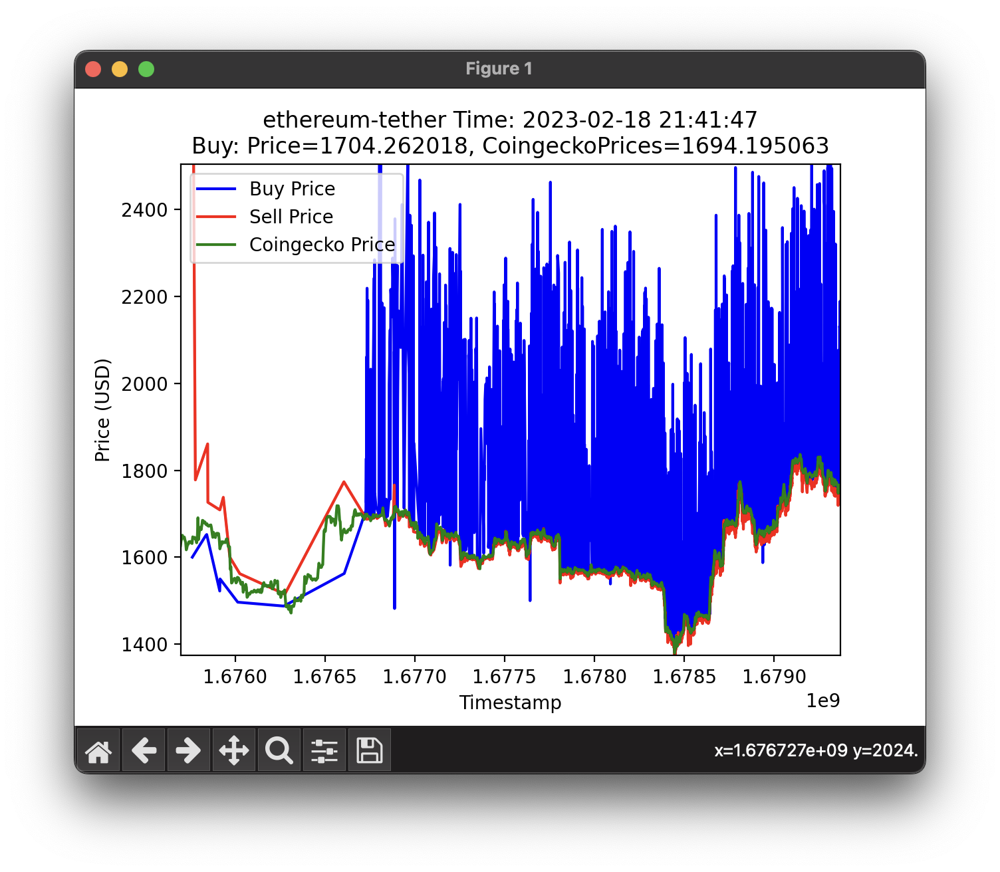
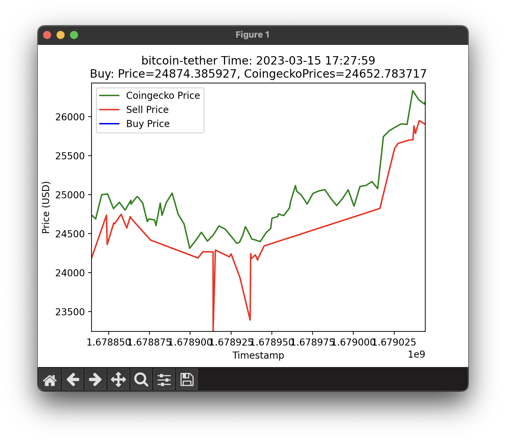

# TokenlonContractAnalysis

## 在 MacOS 安裝 Python 3

```shell
% brew install python3
```

## 將 Python 3 加入至 Path 變數中

```shell
% vim ~/.zshrc

++++++++++++++++++++++++++++++
（…上略）
export PATH="$PATH:/Users/irara/Library/Python/3.9/bin"
++++++++++++++++++++++++++++++
```

## 安裝執行程式碼所需套件

```shell
% pip3 install pycoingecko matplotlib pandas python-dotenv
```

## 執行程式碼

可以調整程式碼中的 coin 及 tether 參數，目前只支援以下 2 種參數組合：

- coin = 'bitcoin'、target = 'tether'
- coin = 'ethereum'、target = 'tether'

```
% git clone git@github.com:oneleo/TokenlonContractAnalysis.git
% cd TokenlonContractAnalysis
% python3 ./analysis/index.py
```

## 執行結果

您可以將滑鼠移到圖上方以顯示 Price 細節

1. ethereum-tether



2. bitcoin-tether


